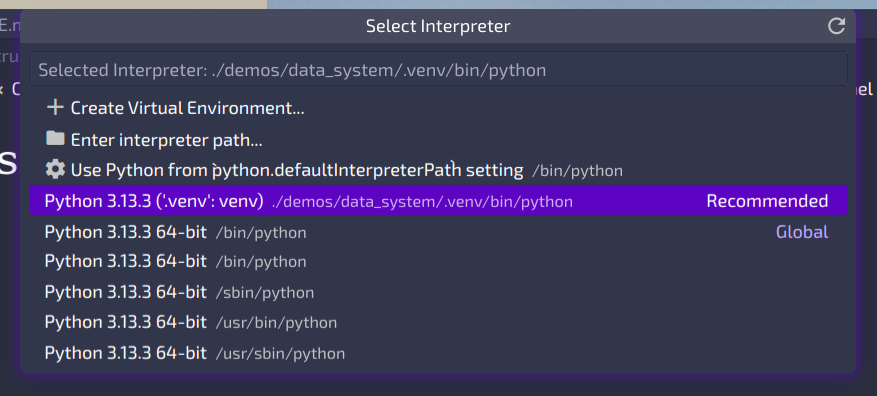

# Data System Example

+ [Data System Example](#data-system-example)
    + [Setup](#setup)
        + [Install packages](#install-packages)
            + [Using `uv` (recommended)](#using-uv-recommended)
            + [Using `pip`](#using-pip)
        + [Select the Python interpreter](#select-the-python-interpreter)

## Setup

Open this repository in your editor / IDE.

### Install packages

Choose one of:

#### Using `uv` (recommended)

```bash
# install uv
curl -LsSf https://astral.sh/uv/install.sh | sh
# other installation methods: https://docs.astral.sh/uv/#installation
uv sync
```

#### Using `pip`

```bash
python -m venv .venv
source .venv/bin/activate
pip install .
```

If you're using another package manager, check the `pyproject.toml` file for the dependencies.

### Select the Python interpreter

In VS Code, for example, the interpreter can be selected from the command palette (`Ctrl+Shift+P`) and typing `Python: Select Interpreter`. Then choose the one in this directory. Example:


